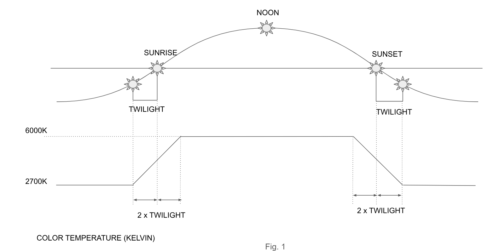

# NightTimeTemperature

NightTimeTemperature is an API microservice that calculates screen brightness based on the user's sun position. The temperature is determined using the relationship depicted in the image below.



---

## Table of Contents

1. [Overview](#overview)
2. [Production vs Development Environments](#production-vs-development-environments)
3. [Build and Deployment Instructions](#build-and-deployment-instructions)
4. [API Endpoints and Usage](#api-endpoints-and-usage)

---

## Overview

NightTimeTemperature provides a simple way to adjust screen brightness according to the position of the sun, with a straightforward API that accepts latitude and longitude as inputs. This service can be used in various applications to manage screen brightness dynamically based on real-time sunlight conditions.

---

## Production vs Development Environments

This Docker service can run in either development or production mode:
- **Development**: Returns a mocked temperature of 15 K regardless of the provided latitude and longitude. All tests and main functions are executed, making it suitable for error-checking during development.
- **Production**: Calculates actual brightness values based on sun position.

Specify the environment in which you'd like to run the service by following the [Build and Deployment Instructions](#build-and-deployment-instructions) below.

---

## Build and Deployment Instructions

1. **Clone the repository** to your local environment and move into it's directory:
   ```bash
   git clone git@github.com:imadahmad97/NightTimeTemperature.git
   cd NightTimeTemperature
   ```

2. **Run Docker Compose** in the project directory:
   - For the **development environment**:
     ```bash
     docker compose --profile dev up --build
     ```
   - For the **production environment**:
     ```bash
     docker compose --profile pr up --build
     ```

3. The container will be deployed on **port 8080**.

---

## API Endpoints and Usage

### `GET /night-time-temperature`

Retrieves the night-time temperature (screen brightness) based on the specified coordinates.

- **Query Parameters**:
  - `lat` (float): Latitude coordinate
  - `lng` (float): Longitude coordinate

- **Returns**:
  - JSON object containing temperature data or an error message.

- **Example GET Request**:
  - Latitude: 49.246292
  - Longitude: -123.116226
  - URL:
    ```plaintext
    http://127.0.0.1:8080/night-time-temperature?lat=49.246292&lng=-123.116226
    ```
